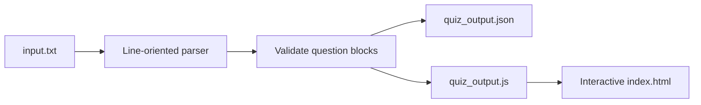

<div align="center">

<sub>Real photography by <a href="https://unsplash.com/photos/assorted-books-ZtI4l8EvyUw">Emil Widlund on Unsplash</a>.</sub>

# CE-I Quizlet
### Turning a large text question bank into a browser-native study system.


[Pipeline](#pipeline) · [Schema](#generated-schema) · [Usage](#usage) · [Engineering](#engineering-notes)
</div>

---

## Overview

CE-I Quizlet is a lightweight content compiler and static quiz application. Its Python parser reads a large plain-text MCQ bank, recognizes question/options/answer/explanation blocks, validates complete records, then emits both JSON and a JavaScript variable for direct browser consumption. The generated data powers a self-contained HTML study interface without a backend.

## Pipeline



## What the parser recognizes

- Question headers beginning with `Q` plus a numeric identifier
- Four labeled answer choices: `A.` through `D.`
- A single `Correct Answer:` field
- Optional `Explanation:` text
- Blank-line and next-question boundaries
- Only complete records with a question, four options, and an answer

## Generated schema

```json
{
  "id": 1,
  "question": "Question text",
  "options": {
    "A": "First choice",
    "B": "Second choice",
    "C": "Third choice",
    "D": "Fourth choice"
  },
  "correct_answer": "A",
  "explanation": "Why the answer is correct"
}
```

## Usage

```bash
git clone https://github.com/TanishC4444/CE-Iquizlet.git
cd CE-Iquizlet
python test.py
```

The compiler reads `input.txt` and writes:

- `quiz_output.json` for portable data interchange;
- `quiz_output.js` as `const quizData = [...]` for static pages.

Serve the repository with a basic static server to open the quiz UI:

```bash
python -m http.server 8000
```

Then visit `http://localhost:8000/index.html`.

## Repository map

```text
CE-Iquizlet/
├── input.txt            source question bank
├── test.py              parser and dual-format compiler
├── quiz_output.json     generated portable dataset
├── quiz_output.js       generated browser dataset
└── index.html           standalone quiz application
```

## Engineering notes

| Decision | Benefit | Tradeoff |
|---|---|---|
| Line-oriented parser | Easy to audit and adapt to a known format | Formatting drift can cause records to be skipped |
| Dual JSON/JS output | Supports both tooling and zero-build static hosting | Large generated files are duplicated |
| Complete-record validation | Prevents malformed quiz items reaching the UI | Partial source questions are silently excluded |
| Static delivery | No server, database, or deployment runtime | Entire dataset ships to the browser |

The checked-in generated artifacts are several megabytes each. For long-term maintainability, build outputs could move to releases or deployment artifacts while the source bank remains canonical.

## Skills demonstrated

Text parsing · state-machine style record assembly · schema normalization · validation · JSON serialization · browser data packaging · static web delivery

## Resume-ready highlight

> Built a Python content compiler that transforms a multi-megabyte plain-text MCQ bank into validated JSON and JavaScript datasets powering a backend-free interactive study application.

## License

No license file is currently included.

